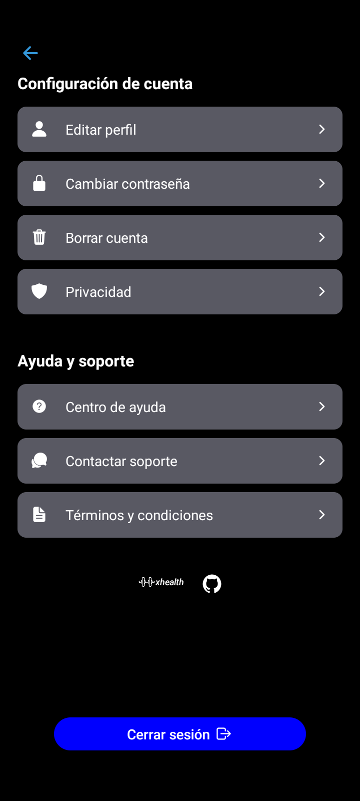
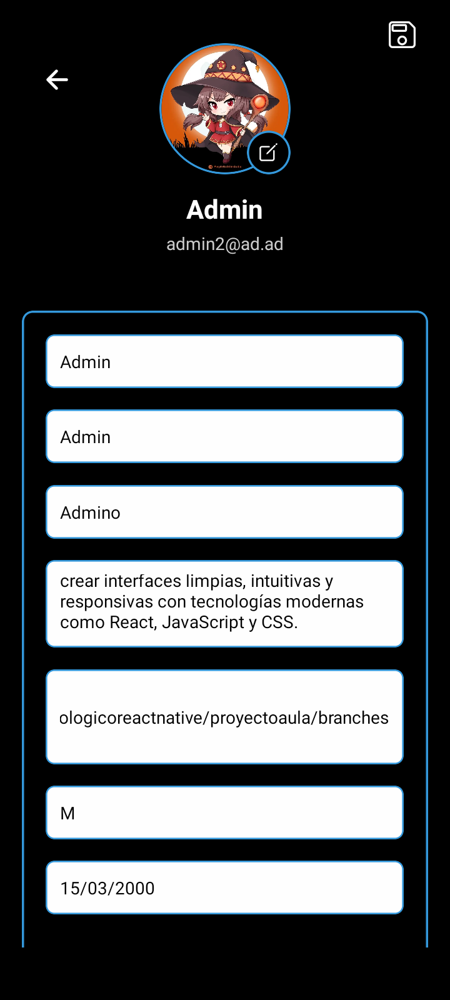
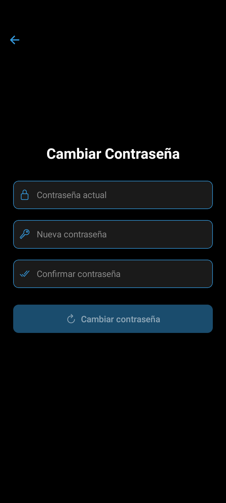
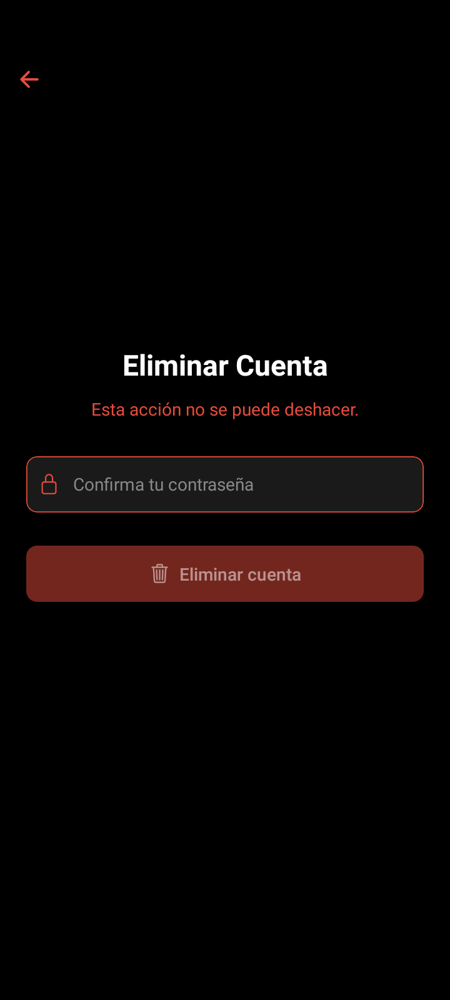

# Proyecto Rutina Ejercicios

## Visión General 🌟  
XHealth es una aplicación móvil integral para el seguimiento de rutinas de ejercicio, progreso físico y gestión de salud. Diseñada con un enfoque en la experiencia del usuario y seguridad de datos.

## Caracteristicas

- Registro e inicio de sesión de usuario

- Navegación por las diferentes pantallas

- Almacenamiento de datos en Firestore
  
- Autenticación segura con Firebase (email, contraseña y modo invitado)

- Perfil de usuario completo con foto, biografía y métricas personales

- Gestión avanzada de contraseñas con validación de fortaleza

- Componentes reutilizables para interfaz consistente

- Diseño adaptable para diferentes tamaños de pantalla

- Protección de datos con políticas claras de privacidad

## Dependencias Principales 📦 
Core
React 18.3.1: Biblioteca principal para construcción de interfaces

React Native 0.76.9: Framework para desarrollo móvil multiplataforma

Expo 52.0.43: Plataforma para desarrollo de aplicaciones universales

Navegación
React Navigation: Sistema completo de navegación

@react-navigation/native 7.1.4

@react-navigation/stack 7.2.8

@react-navigation/bottom-tabs 7.3.10

Firebase
Firebase 11.6.0: Backend como servicio

React Native Firebase: Integración nativa

@react-native-firebase/app 21.13.0

Expo Firebase Modules:

expo-firebase-core 6.0.0

expo-firebase-analytics 8.0.0

Utilidades
Async Storage 1.24.0: Almacenamiento persistente

DateTimePicker 8.3.0: Selector de fechas nativo

Gesture Handler 2.20.2: Manejo de gestos

Keyboard Aware Scroll 0.9.5: Adaptación al teclado

## Instalacion

1. Clona el repositorio
3. npm install expo@52.0.43
4. Arranca la App con `npm start or npx expo start`

## Tecnologias Utilizadas

## Tecnologías Utilizadas 🛠 
- Frontend:	React Native, Expo, React Navigation
- Backend:	Firebase Authentication, Firestore Database, Firebase Storage
- Estilos: StyleSheet, Flexbox
- Componentes UI:	Ionicons, Componentes personalizados
- Gestión de Estado:	Context API, Hooks

## Requisitos previos:

- Node.js (v16+)

- npm/yarn

- Expo CLI

- Firebase account
- 
## Vista Previa
- LoginScreen

- RegisterScreen

- HomeScreen

- ProfileScreen

- SettingScreen

- EditProfile

- ChangePassword

- DeletePassword
